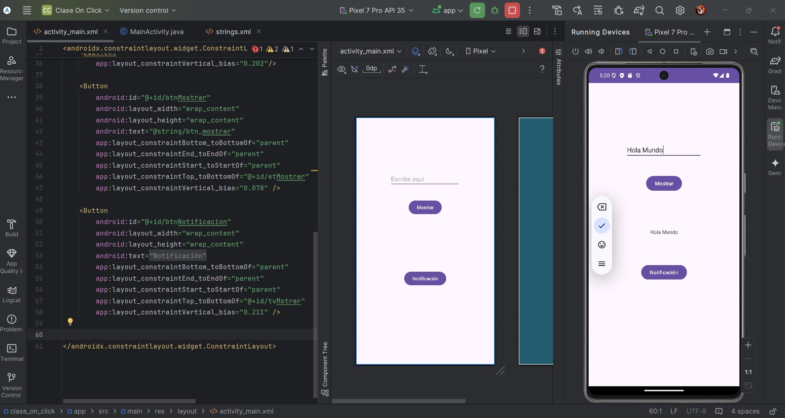
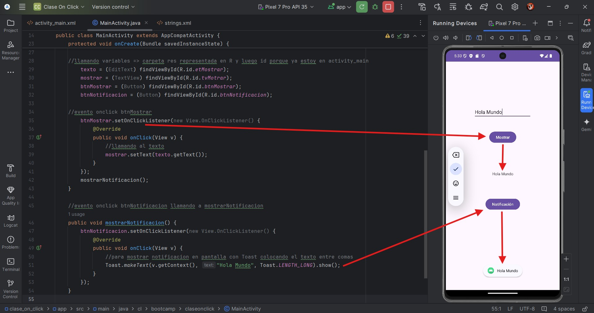
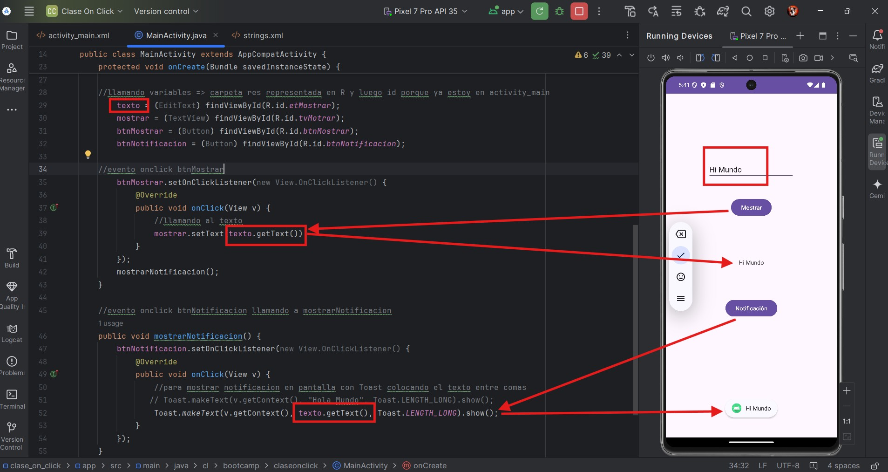
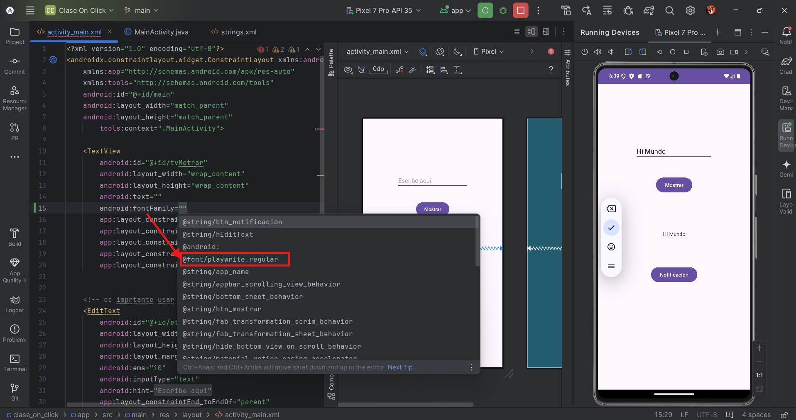
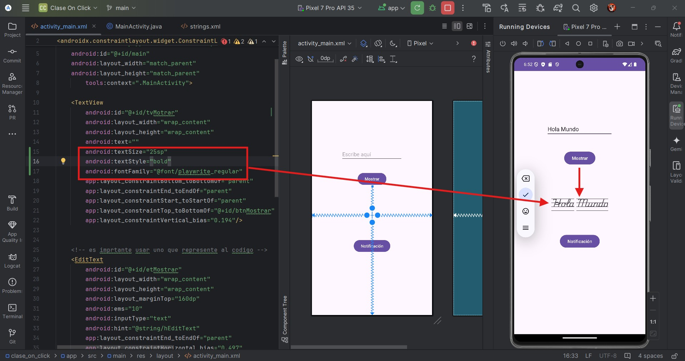
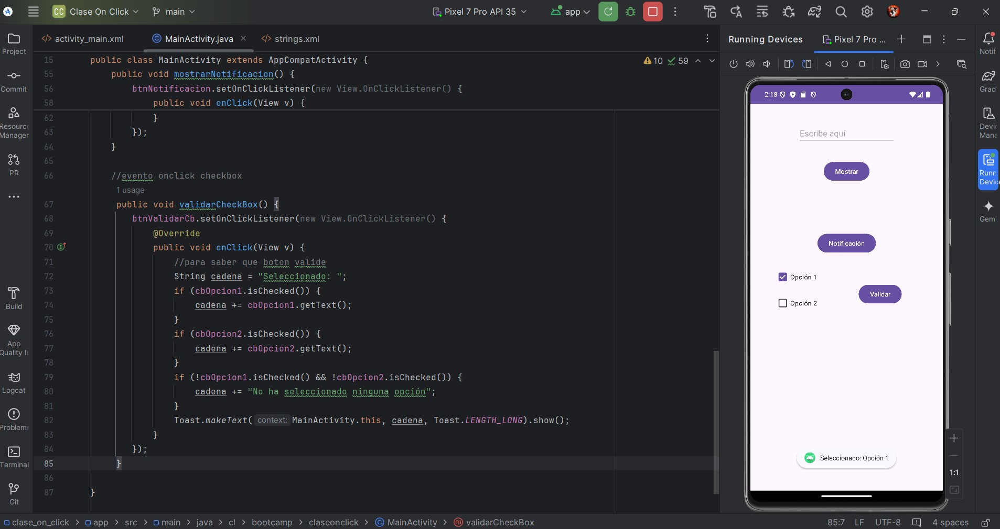
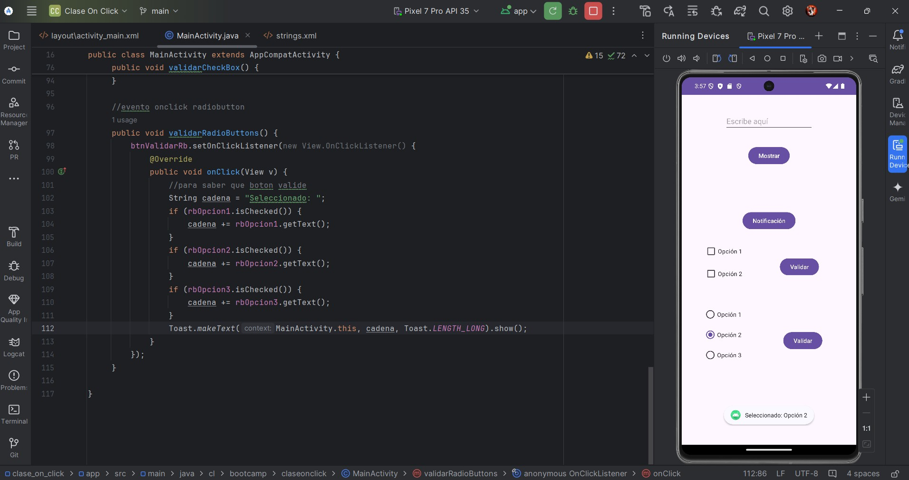
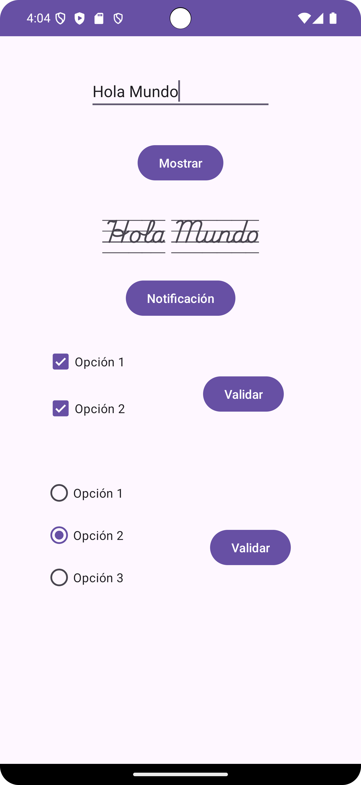

**_<h1 align="center">:vulcan_salute: Ejercicio Clase Eventos OnClick :computer:</h1>_**

**<h2>Evento OnClick</h2>**
Proyecto en que se van a crear eventos asociados a botones y cambio en fuentes, con la creación de su respectiva carpeta

Utilizando dos botones se muestran dos formas diferentes de llamar un mensaje, una en pantalla y otra como emergente:
- pantalla:

- emergente:

- Puedo llamar en ambas al mismo elemento o pueden ser diferentes, en este caso llame al mismo:

**<h2>Cambio de Fuente</h2>**
- Descargo desde la página que yo elija, en este caso google fonts y creo la carpeta donde se va a almacenar. Click derecho en res => New => Android Resource Directory => font
- Guardo la fuente descargada en la carpeta recién creada y la llamo:

- Puedo editarla cambiando color, estilo u otros, en este caso aumente su tamaño y coloque negrita:

**<h2>Botones CheckBox</h2>**
- Coloque dos opciones en el checkbox y con el boton validar se ejecuto evento onclick que muestra en pantalla la opción seleccionada

**<h2>Botones Radio Button</h2>**
- Coloque tres opciones y el boton validar que ejecuta un evento onclick que muestra en pantalla la opción seleccionada

**<h2>Resumen</h2>**
- Captura de pantalla con todo lo realizado
